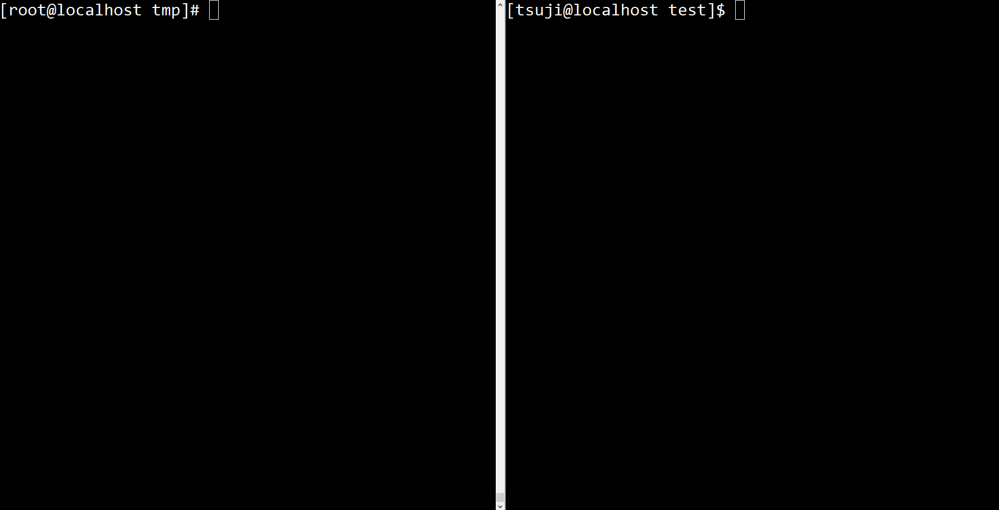

ttycopy [](https://github.com/d-tsuji/ttycopy/releases/latest)
=======


What is ttycopy?
-----
+ This is a simple tool that can scan terminals of other users through tty or pts, inspired by [ttylog](https://github.com/gitpan/ttylog).
+ Get the pid of tty and pts you want to scan,
It is realized by issuing the same read system call as the referenced terminal to my terminal by strace.



INSTALL
-----

```
wget https://github.com/d-tsuji/ttycopy/releases/latest/download/ttycopy && chmod +x ttycopy
```

REQUIRE
-----

- strace

USAGE
-----

```
./ttycopy pts/x
```

Type "w" to find tty:
```
  [root@localhost ~]$ w
   20:32:24 up 3 days, 19:45,  4 users,  load average: 0.00, 0.01, 0.05
  USER     TTY      FROM             LOGIN@   IDLE   JCPU   PCPU WHAT
  root     pts/0    tty.sample.com     16:12    7:52   0.38s  0.38s w
  huga     pts/1    test.for           16:12   23:52   1.16s  0.00s less -s
  John     pts/3    aaa.jp             20:11   20:24   0.04s  0.04s -bash
  dai001   pts/4    localhost          20:14    0.00s  0.08s  0.01s -bash
```

If you want to scan tty of USER dai001, type:
```
  [root@host root]# ./ttycopy pts/4
```
